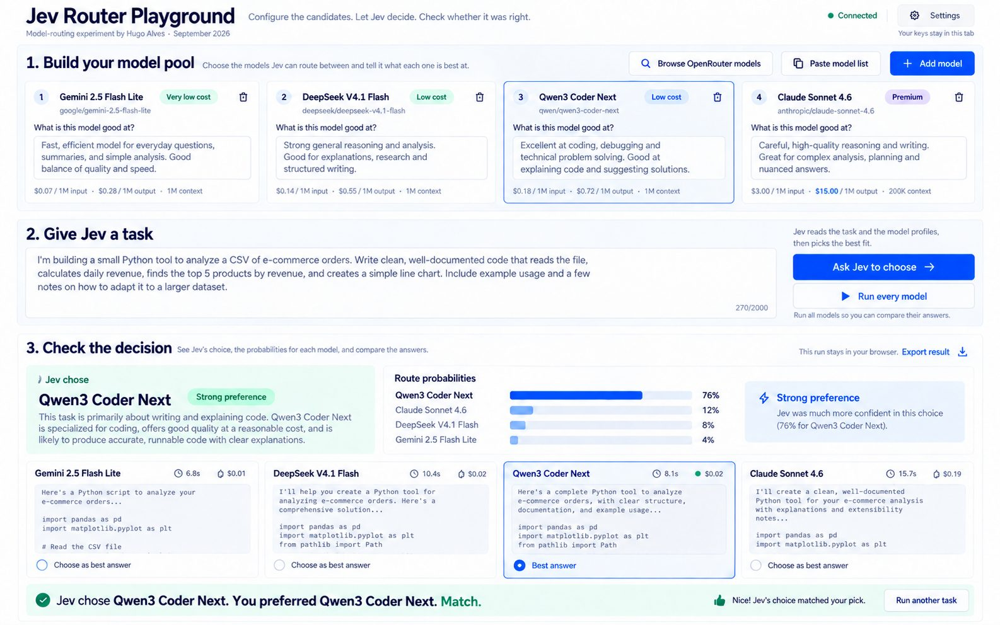

# Jev Router Playground

> **Configure the candidates. Let Jev decide. Check whether it was right.**

An interactive model-routing experiment. Build a pool of OpenRouter models,
give Jev a task, watch it pick a model with calibrated probabilities — then
compare its pick with the answer you actually judge best.



**Live demo →** <https://kvhx37ziab90c.space.minimax.io>

---

## What it does

1. **Build your model pool.** Add candidates individually, paste a list, or
   browse the OpenRouter catalogue. For each one, write a routing description
   and read its pricing and context window.
2. **Give Jev a task.** Type the prompt. Jev reads the task and the candidate
   profiles, then selects the model it considers the best fit. You do not
   steer it towards price, speed, or a specific provider.
3. **Check the decision.** See Jev's choice, its plain-language explanation,
   the full probability distribution across candidates, and (if you asked it
   to run them) the answer from each model with timing and approximate cost.
   Pick the answer you prefer — the footer reports match or mismatch with
   Jev's pick, and the whole observation is one click away as JSON.

Each run produces an exportable record. Across many tasks, you can measure
how often Jev's routing agrees with the answer you judge best, where its
decisions succeed or fail, and whether running only its choice preserves
enough answer quality.

---

## Quick start

There is no build step. Serve the folder over plain HTTP:

```sh
python3 -m http.server 8000
# → http://localhost:8000
```

Or with Node:

```sh
npx --yes serve . -l 8000
```

Opening `index.html` directly with `file://` works in most browsers, but some
APIs require an `http://` or `https://` origin, so serving over HTTP is
recommended.

---

## Configure

Click **Settings** (top right) and paste:

- **TypeSafe / Jev key** — required to ask Jev to choose. Get one at
  [typesafe.ai](https://typesafe.ai).
- **OpenRouter key** — required to browse the catalogue and run models. Get
  one at [openrouter.ai/keys](https://openrouter.ai/keys).

Both keys live in `sessionStorage` for the current tab only. The OpenRouter
key is sent directly to OpenRouter. With the default configuration, the Jev
key passes through the included Cloudflare CORS proxy and is forwarded to
TypeSafe; the proxy does not deliberately store or log it. Self-host the proxy
if you do not want to trust the public instance with the Jev request in
transit.

### Endpoints

| Service    | Default URL                                                | Purpose                       |
|------------|------------------------------------------------------------|-------------------------------|
| Jev        | `https://jev-router-proxy.xperiment.workers.dev/jev`       | Routing via CORS proxy        |
| OpenRouter | `https://openrouter.ai/api/v1`                             | Catalogue + chat completions  |

The Jev default routes through a CORS proxy because TypeSafe's API does not
return CORS headers on 4xx responses, which makes every direct browser call
fail with *Failed to fetch*. To call TypeSafe directly, paste
`https://api.typesafe.ai/v1/systemone` into Settings → Advanced → Jev endpoint
(useful for self-hosting or server-side runs).

---

## How the routing call works

Jev's `systemone` endpoint accepts a request with one `noul` (probability)
question per candidate. We treat each candidate as a question:

```js
{
  model: 'jev-latest',
  state: {
    task: '<the user prompt>',
    candidates: [{ id, name, description }, ...]
  },
  questions: {
    '<candidate-id>': {
      type: 'noul',
      instructions: 'Task: ... Candidate: ... Strengths: ...\nReturn probability 0–1 that this candidate is the best fit.'
    }
  }
}
```

The response gives one probability per candidate. The chosen model is the
highest probability; the full distribution is shown as bars.

A second OpenRouter call (using the cheapest in-pool model, with a sensible
fallback) generates the plain-language explanation paragraph next to Jev's
pick.

---

## Self-host the CORS proxy (optional)

If you'd rather own the endpoint instead of using the bundled
`xperiment.workers.dev` proxy, deploy your own Cloudflare Worker:

```sh
cd proxy-worker
npx wrangler deploy
# → https://jev-router-proxy.<your-subdomain>.workers.dev
```

Then paste that URL into Settings → Advanced → Jev endpoint and click Save.

The proxy is ~90 lines of code with no dependencies. It forwards your
`Authorization` header to TypeSafe and adds `Access-Control-Allow-*` headers
on the way back.

---

## Deploy to a public host

Any static host works: Cloudflare Pages, Netlify, Vercel, GitHub Pages, an S3
bucket, or a Cloudflare Worker that returns the assets. The three core files
(`index.html`, `styles.css`, `app.js`) are self-contained.

```sh
npx wrangler pages deploy . --project-name jev-router-playground
```

---

## Privacy & security

- **Static frontend, small Jev proxy.** The browser talks directly to
  OpenRouter; Jev requests use the configured CORS proxy (the public default
  or one you self-host).
- **No analytics, no telemetry, no third-party scripts.**
- **Keys in `sessionStorage` only.** They disappear when the tab closes.
- **Pool + non-secret settings in `localStorage`.** Clearing site data
  clears everything.
- **Export is local.** The **Export result** button produces a JSON file
  client-side; nothing is uploaded.

> ⚠️ Always review what you paste in **Settings** before saving. The app
> never asks for a key it doesn't need, but you should never paste a key into
> any tool you don't trust.

---

## Project layout

```
.
├── README.md           ← you are here
├── LICENSE
├── CHANGELOG.md
├── index.html          ← 3-section markup + 5 modals
├── styles.css          ← tokens, layout, components
├── app.js              ← state, render, API calls, export
├── proxy-worker/       ← optional CORS proxy for TypeSafe
│   ├── wrangler.toml
│   └── index.js
├── assets/             ← README hero image, future screenshots
└── .github/
    ├── ISSUE_TEMPLATE/
    └── PULL_REQUEST_TEMPLATE.md
```

---

## Contributing

Issues and pull requests are welcome. If you want to ship a non-trivial
change, please open an issue first so we can agree on direction.

Useful starting points:

- **`askJev()`** in `app.js` builds the routing payload.
- **`buildJevInstruction()`** decides what each candidate sees.
- **`renderDecision()`** is the entry point for the result panel.
- **`runEveryModel()`** runs the candidate set in parallel with per-model
  timeouts and incremental rendering.

---

## Credits

Built by **Hugo Alves** for the September 2026 Jev launch. Powered by
[TypeSafe's Jev](https://typesafe.ai) and
[OpenRouter](https://openrouter.ai).

## License

[MIT](./LICENSE) — see the file for details.
